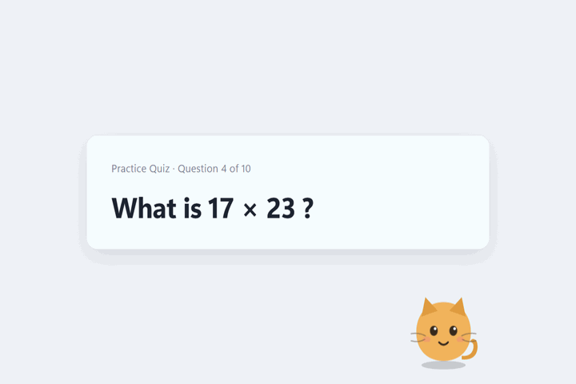

# screenpet

A desktop pet that reads your screen and answers the question on it. **On the
default settings nothing leaves your machine at all** — the model runs here, the
OCR runs here, the speech runs here.

There is one switch that changes that, off out of the box, and everything it
unlocks is itself off until you say so: weather, web lookups, and the option of
answering with a hosted model instead of a local one. See "Going outside" for
exactly what each of those sends and to whom.



Phase 3. The pet has a care loop, lives in the tray, has a settings window, four
skins and a wardrobe, uses a vision model when there is no text to read, and
builds into a Windows installer.

## The one rule

**Pet state never gates answering.** A starving, exhausted pet still answers your
question, and still answers it correctly. Mood changes the wording and nothing
else. Gating usefulness on pet care is charming for a day and infuriating after
that, so there is a test asserting the pet can never be told to decline.

## The care loop

Four stats, all 0..100, all higher-is-better: **fullness**, **happiness**,
**energy**, **bond**.

Decay is a pure function of elapsed wall-clock time, so closing the app for eight
hours gives exactly the same result as leaving it open for eight hours. It is
capped at 24 hours of decay however long you were away — come back from holiday
to a hungry pet, not a dead one. Bond never decays; it is the relationship, not
a need.

| You do | It does |
| --- | --- |
| Click the pet | Headpat. Heart eyes, a shower of 💕, happiness and bond up. |
| Double-click | Tickle. Wiggles and giggles — and see below if you keep going. |
| Drag it | Picks it up and moves it. Goes dizzy, complains mildly. |
| Move the mouse | Its eyes follow the cursor. |
| Right-click | Menu: Feed, Play, Tickle, Talk, Read screen, Settings, Quit. |
| Hover | Perks up, and shows the three need bars. |
| Walk away 5 minutes | Naps, with `z`s. Energy regenerates instead of draining. |
| Come back | Notices, and says so. |

A full pet refuses food and a tired pet refuses to play, and the menu greys those
out rather than letting you find out by clicking. Every action has a cooldown so
you cannot spam a stat to 100. Being on cooldown says nothing at all — a pet that
ignores a fourth headpat in a row has better manners than one that complains
about it.

### Keep poking it

Tickling is the one thing you can do over and over, so it is the one that
escalates:

> giggle → giggle → **shy** → **annoyed** → **RAGE** → **crying**

Each rung has its own bank of lines, and there is a floor at the bottom — nothing
comes after crying. An escalation with an end reads as a creature with feelings;
one that giggles forever reads as a button.

Cooldown refusals count as pokes here, unlike everywhere else. A pet that
silently ignores your fourth poke feels broken rather than patient.

Bouts expire after twelve seconds, so coming back from a meeting does not resume
mid-tantrum, and the counter lives in memory only — forgiveness on relaunch is
the right default for something that lives on your taskbar.

The pet also **praises you**, every other bit of small talk, and is immediately
embarrassed about having done it. The compliments are vague on purpose: it cannot
see what you are working on, and a specific compliment about work it has not seen
is a lie with a smiley face on it.

Mood is derived from the stats, never stored, and drives both the sprite and the
tone of answers: `sleepy`, `hungry`, `sad`, `happy`, `neutral`.

Bond is the one stat that never falls, so it is the only one that says anything
out loud — it has four milestones and that is the whole of it.

Unprompted talk is throttled twice over: nagging at most once every three hours,
and idle small talk at most once every 45 minutes and only when the pet has
nothing to complain about. A pet that talks more than that gets uninstalled.

## Pets

Ten of them: **blob**, **cat**, **pup**, **bun**, **bird**, **dragon**, **fox**,
**axolotl**, **ghost**, **robot**. Pick one in Settings, next to the ten skins — butter, mint, blossom, slate, coal, cream,
moss, plum, sky, coral. They are orthogonal: every pet works in every palette,
and every outfit works over both, so it is 10 × 10 × 9 rather than ten.

A palette is **three CSS variables** — `--body`, `--ear`, `--cheek` — defined in
one place. The settings swatch paints itself from the same three off its own
`data-skin`, so a new skin is one rule in one file; a test asserts `settings.css`
never names a skin, because the version of this that hardcoded four swatch
colours is exactly how a skin ships as a colourless circle.

Every species keeps the **same face rig**: same classes, same coordinates. Only
ears, body outline and extras (tail, crest, whiskers) change. That is the whole
trick — all thirty-nine expressions work on all ten pets without a single extra
rule, and the next pet is one CSS block, not a new sprite sheet. The ghost and
the robot are the two that swap `.body` as well; everything else hangs off it.

Shapes live in `renderer/pets.css`, which the pet window, the settings previews
and the demo stage all load. One definition per pet, so the picker previews are
drawn by the same rules as the real thing and cannot disagree with it. A test
asserts no species rule sneaks into `style.css`, which only the pet window
loads — a shape hiding in there would render correctly and preview as a blob.

`npm run verify:ui` writes `pet-species.png`: every pet in every skin.

### They each behave a bit differently

**Voices.** Each species has its own lines for the things it says most — idling,
being fed, patted, played with. Everything else falls through to the shared bank,
so a new pet means writing the lines it actually has an opinion about rather
than filling in a 15-cell grid. The cat says `you may continue`; the pup says
`again again again`.

**Idle quirks.** Every 9–23 seconds of nothing happening, the pet does something:
the cat stretches and flicks its tail, the pup hops and wags, the bun twitches an
ear, the bird pecks, the dragon rumbles and sways, the blob squishes, the fox
pounces, the axolotl paddles, the ghost fades as it drifts up, and the robot
glitches in four hard steps rather than easing anywhere — the one that is not a
creature should not move like one. They all glance around while doing it.

The renderer only decides *when* — which movement is entirely `pets.css`'s
business. A species rule replaces the resting bob for the quirk's duration, which
is what makes it read as a movement rather than a wobble on top of one. Tails
rotate about where they meet the body, not their own centre; get that wrong and
the tail detaches mid-wag.

## Faces

Mood is the long run; an expression is the reaction to something that just
happened, laid over the top and cleared after a couple of seconds.

`smile` `grin` `love` `yum` `giggle` `oh` `hmm` `sulk` `dizzy`
`shy` `proud` `joy` `annoyed` `rage` `cry`
`listen` `curious` `wink` `doze` `oops`

They are CSS, not sprites — the mouth is a `d: path(...)` swap and the extras
(brows, tongue, tears, sweat, sparkle, anger mark, `z`s) are `display` toggles.
So they cost no images, and they compose with all ten skins for free.

`rage` is deliberately the `annoyed` face turned up — steeper brows, angrier
mouth, a shake and a hue shift — rather than a face of its own. That is what
makes it read as the same pet getting angrier instead of a different pet turning
up.

**The bow** is an accessory on the shared rig, not part of any body, so all six
species wear it with no per-species rules. It appears for the cute half of the
range only — `love` `shy` `giggle` `proud` `joy` `wink` — and a test asserts
`rage`, `cry` and `oops` never get one. A pet in tears wearing a party bow is a
different feeling entirely.

### The wardrobe

Eight outfits, picked in Settings, worn by every species:

`bow` `shades` `halo` `hero` `party` `wizard` `crown` `headphones`

The first three were already drawn — the bow for the cute faces, the shades for
`cool`, the halo for `innocent` — so wearing one costs a CSS rule rather than a
shape. `hero` is a **mask and a cape**, and the cape is drawn before the body in
the markup for the same reason the tail is: in front, it is a bib.

The mask is cut with **holes rather than lenses**. A solid mask over both eyes
would take the gaze, the blink and most of the thirty-nine faces with it, so it
is one path with `fill-rule="evenodd"` and two ellipses punched out of it. A
check asserts the eyes are still `display: block` under every outfit.

What is on is **one value** on the root element, not a set. An outfit is a
decision — "hero" is two shapes and one choice — and a list of items would need a
second validator to stop a hand-edited settings file asking for four hats.

Nothing in the wardrobe is species-aware. A hat on a bun sits between the ears
rather than on top of them; six sets of per-species nudges to make it read as a
slightly better hat is not a trade worth making. `npm run verify:ui` writes
`pet-wardrobe.png` — every outfit on every pet — so that stays a decision rather
than an accident.

Every face is reachable from something that actually happens, which is why there
are twenty-one and not fifty: `listen` while the microphone is open, `curious`
when it heard nothing back, `wink` on every other spoken reply so a long
conversation is not one fixed smile, `doze` when the machine goes idle — it used
to nod off silently and just turn grey, which reads as a crash rather than a nap
— and `oops` for a genuine failure, which is a different thing from `sulk`. The
pet declining to eat because it is full is not an error.

**Emoji rain.** Each feeling drops a handful of emoji in from above the head, and
each has **several sets picked at random per burst** — a headpat is 💕💖💗 or
💘💞 or 🎀💕🌷, and joy might be 🎉🎊✨, 🥳, 🍾 or 🎆. The same five hearts every
single time stops reading as a reaction and starts reading as a loading spinner.
Rage and annoyance are the exceptions and stay fixed; being cross is not a mood
with variations.

One mechanism for all of it — the renderer picks the set, fall depth and stagger,
the stylesheet says only how a falling thing moves, and a new feeling clears
whatever is still in the air. `smile`, `hmm` and `oh` deliberately drop nothing:
they fire on hover, and confetti on every mouse move would be unbearable. There
are tests for both the variety and the silence.

The bubble sits at `z-index: 1` so the rain falls *behind* it. The drops start
74px above the pet's head, which is exactly where the speech bubble is, and
without this a heart lands on top of the answer.

Expression rules must stay **below** the mood rules in `style.css`. Both are
`.pet[data-*]`, so they have identical specificity and source order is the only
thing that makes a reaction beat the mood underneath it. There is a test for
that, and another asserting every expression the code can emit has a rule to
render it.

`npm run verify:ui` writes `pet-faces.png`, which is all of them side by side
with animations paused.

## How it talks

The pet answers the way a person answers out loud — not like a search result, and
not like a greetings card either:

> Three hundred ninety-one. That's seventeen times twenty-three.
>
> A 401 means Unauthorized — you asked for something without valid credentials,
> like a login token.

**The answer itself is not negotiable.** The prompt says to give it plainly and
completely, never to hide it or hint at it. That clause is load-bearing: this same
file used to open with "you are a desktop pet" and produced 79–240 character
replies that narrated the screen and talked about themselves, which is why the
wording was stripped back to something that answered but sounded like a lookup.
The version with the answer pinned down measured **9/9 correct across three
screens**, three runs each, with the voice back. Re-measure before editing it.

**Warmth was asked for as an "affectionate flourish", and that phrasing is what
produced the tildes, the emoji and the third-person cooing.** It now asks for how
a person actually speaks — contractions, plain words, nothing stiff — and caps the
humour at one dry aside *after* the answer, with an explicit way out: if nothing
about it is funny, leave it out. The escape hatch matters. Without it a small
model strains for a joke on questions that do not have one in them, and a strained
joke is worse than a straight answer. Emoji, asterisks and narrated actions are
now forbidden outright rather than rationed.

**A screen with no question is not a failure.** It used to say `I could not read
any text on screen` or `I cannot find a clear question`, which is technically
true and reads like a broken tool. Now:

> Oh, just reminders! No questions here today.

Two layers do that. The prompt forbids refusal wording outright, and if the model
returns nothing at all, `brain.js` returns an empty string rather than a sentence
— the pet's voice lives in the line bank in `pet-state.js`, and a fallback
written in `brain.js` would be a second, blander personality in the one file
that is meant to have none.

Small models like to wrap a reply in quotation marks, often opening one they
never close. `unquote` strips that: it is the model narrating a line of dialogue,
not the pet speaking. Quotes inside an answer survive.

## Out loud, and back

Both directions of speech are on-device, and both are the platform's own — no
model files, no downloads, nothing new to trust.

**It speaks** through Windows' installed voices, via the platform synthesiser.
The only voices it will use are ones flagged `localService`: some platforms list
network-rendered voices next to the installed ones and nothing else tells them
apart. Emoji and `*stage directions*` are stripped before speaking, because
"money with wings" read aloud is not the joke. Mute lives in the tray, one click,
because the moment you want it quiet is the moment a call starts.

The mouth moving while it talks is a **class**, not an expression, and that
distinction is load-bearing: an expression would replace whatever face the pet
was already making, and a raging pet that goes blank the moment it opens its
mouth is not raging. There is a test pinning it.

**It makes a noise first.** A woof, a meow, a chirp, a rumble — whichever it is —
in the moment before the words. There are no audio files: nothing is recorded,
licensed or unpacked out of the asar, because each voice is six lines of
oscillators and filtered noise in [renderer/voices.js](renderer/voices.js). A
bark is a low thump with a burst of noise on it; a meow is a sawtooth whose pitch
goes up before it comes down, through a lowpass filter standing in for a mouth; a
chirp is over before you can place it.

The **face** decides how it comes out. Five feelings — neutral, happy, sad,
cross, sleepy — each a pitch, a speed and a volume, so the cat has one meow and
five ways of meaning it. A crying pet is slower and lower than a delighted one
without a second recipe existing.

**That is enough for most faces and a lie for the rest.** A cross cat does not
meow faster, it *hisses*, and there is no setting of pitch and speed that turns a
meow into a hiss. So there is a second table of hand-written calls — about thirty
— for the feelings where the animal has a different sound entirely, and the
species' own voice is used everywhere else:

| | what it does instead of its voice |
| --- | --- |
| cat | hisses when cross, yowls when sad, **trills** when pleased, **purrs** when sleepy |
| pup | growls, whines — a whine goes *up*, which is why it reads as asking for something |
| bun | **thumps a foot and says nothing at all**, and honks when pleased, which rabbits genuinely do |
| bird | rattles its beak, sings three rising notes |
| dragon | roars, idles like an engine, and snores in two parts — in, then out |
| fox | **gekkers**: the stuttering row foxes have at 3am |
| axolotl | has no vocal cords, so every feeling is water moving |
| ghost | moans, and the moan is the one sound allowed to outstay itself |
| robot | powers down when sad — the only place it is allowed to bend a pitch |

A call is played *straight*, with the feeling not bent into it, because it
already is the feeling: running a hiss through cross's 1.3× speed makes a shorter
hiss and nothing else.

Two things had to be measured rather than written. An exponential envelope spends
over half its length below anything you can hear, so the pulse-based calls — the
purr, the rattle, the dragon's idle — needed to be about twice as long and twice
as loud as they looked on paper; the first purr rendered as *silence*. And
`verify:ui` now renders all fifty species-and-feeling combinations, checking each
is audible, does not clip, and — the check that matters — sounds measurably
**different from that species' ordinary voice**. A feeling that renders
identically has not been expressed.

Assertions can measure a sound but cannot tell you it is *wrong*, so
`verify:ui` renders every voice into an `OfflineAudioContext` and checks the
three things a broken one fails: it is audible at all, it does not clip, and it
lasts between 40 and 700ms. The bun and the bird both failed that last check on
the first pass — a squeak at the top of the range is most of the way to a sound
you cannot hear — and were lengthened until they passed.

`Little noises` in settings, and `Mute noises` in the tray, separate from the
voice: muting a pet that reads your screen aloud and muting a pet that goes
"woof" are two different wants, and the second outstays its welcome first.

**It listens** through one of two recognisers, both on this machine: Windows'
`System.Speech`, driven from `listen.ps1` exactly the way OCR is driven from
`ocr.ps1`, or whisper.cpp if you have installed it — see
[the measurement below](#that-threshold-was-hiding-a-much-worse-problem), which is
not a close call. Push to talk either way: `Listen…` opens the microphone, one
phrase is recognised, and it shuts. No wake word and no listening loop — a pet
that is always listening is a microphone with a face on it.

Chromium's `SpeechRecognition` is the obvious way to add dictation to an Electron
app, and it uploads the audio to Google. **That is the one thing this app may
never do**, so there is a test asserting the string appears in none of the source
files rather than a comment asking nicely.

**Noise is the real failure mode, not silence.** Dictation does not return
"nothing" when nobody is speaking — it returns a fluent sentence with a terrible
score behind it. Measured on this machine, three seconds of an ordinary room:

```
heard:      "Note to the audit got a"
confidence: 0.029
```

So a result under `0.30` is discarded and the pet says it did not catch that. The
threshold clears the measured noise floor by an order of magnitude, but it has
**not** been calibrated against real speech on a quiet headset — rooms and
microphones differ. If a perfectly clear sentence keeps coming back as "I did not
catch that", lower it:

```bash
set SCREENPET_MIC_CONFIDENCE=0.15
```

### That threshold was hiding a much worse problem

The paragraph above used to end by saying SAPI is "fair for plain sentences and
poor for technical words", and that swapping in whisper.cpp was a trade worth
noting rather than taking. Then it was measured: fourteen phrases spoken into the
actual microphone, the same WAV file fed to both engines — `SetInputToWaveFile`
for System.Speech, so neither gets an advantage from the recording.

| | System.Speech | whisper tiny.en | whisper base.en |
| --- | --- | --- | --- |
| Word error rate | **88%** | 51% | 49% |
| ...with the vocabulary prompt | — | 27% | **21%** |
| Discarded by the `0.30` floor | **14 of 14** | — | — |
| Median latency | 1218ms (544ms engine, rest is the PowerShell spawn) | 831ms | 1647ms |

**88% is not "poor at technical words", it is not working.** `git rebase onto
main` came back as "The leaders of the way". `run npm install then npm test` as
"And humans who didn't have this". And the confidence floor this page defends so
carefully discarded *every single result* — median confidence 0.107, a third of
the threshold. On this voice, dictation never answered at all; it always said it
did not catch that.

Two things were ruled out rather than assumed. The recordings average −25 dBFS,
so they were peak-normalised to −3 and re-run: whisper moved 49% → 46% and SAPI
got **worse**, so level is not the story. Two of the fourteen files are clipped
mid-phrase; excluding them moves base.en to 18% and leaves SAPI at 88%.

**The largest single win is a string, not a model.** whisper takes an initial
prompt that biases decoding, and the app knows its own vocabulary — npm, JSON,
rebase, Postgres, async. That one constant took base.en from 49% to 21%, and the
technical phrases from 87% to 29%. Eight of fourteen improved and none regressed.
It lives in [whisper.js](whisper.js) and it looks exactly like a magic string
somebody should tidy away, which is why there is a test pinning it.

### Turning it on

`Recognised by` in settings, three values, matching the shape `vision` already
uses: **a local engine if installed, Windows otherwise** (the default), or either
by name. Everything runs on this machine; nothing reaches the network.

Neither engine is bundled — shipping someone else's build inside this installer
is a licensing and signing question this project has not answered. Put a binary
and its model in the app's own folder and the app picks up whichever is there:

```
%APPDATA%\screenpet\whisper\whisper-cli.exe    + model.bin       (whisper)
%APPDATA%\screenpet\whisper\parakeet-cli.exe   + parakeet.bin    (parakeet)
```

Both binaries are in the same [whisper.cpp release](https://github.com/ggml-org/whisper.cpp/releases)
(`whisper-bin-x64.zip`, 7.9MB — copy the whole `Release` folder, the .dlls are
needed). Models: whisper's are on [Hugging Face](https://huggingface.co/ggerganov/whisper.cpp)
(`ggml-tiny.en.bin` 75MB, `ggml-base.en.bin` 142MB), parakeet's are at
[ggml-org/parakeet-GGUF](https://huggingface.co/ggml-org/parakeet-GGUF)
(`ggml-parakeet-tdt-0.6b-v3-q4_k.bin`, 397MB — note the **`.bin` from ggml-org**,
not the community GGUF conversions, which this binary rejects with
`invalid model data (bad magic)`). Rename to the name in the table above.

**Each engine has its own model name, and that is what picks the engine.** The
release ships both binaries in one folder, so "both `.exe`s present, one model"
is the ordinary case for anyone who copied the folder as instructed. Choosing on
the binary would hand a whisper model to parakeet and kill dictation for exactly
the people who followed the directions.

Which to install: **whisper `tiny.en` if you want this over with** — 75MB, and
with the prompt it beats bare `base.en` while being *faster than the PowerShell
spawn SAPI needs*. **Parakeet if accuracy on commands matters more than 397MB.**

The folder is fixed and there is no setting for it. A path to an executable in
`settings.json` is arbitrary code execution with a nice label on it, and this app
hardcodes its OCR script, its weather host and its provider URLs for that reason.

**The audio still never touches disk.** whisper-cli reads the WAV from stdin,
which costs one piece of arcana: with `-f -` it derives its output name from the
input name, ends up with `-`, decides that means stdout and silently prints
nothing. `-of` gives it a name to be quiet about. Removing that flag looks like
tidying and turns dictation off.

**Neither engine has a confidence score**, so the noise problem the `0.30` floor
exists for comes back in a different shape: handed two seconds of a quiet room,
whisper base.en answers "you". The gate is therefore in two places — the recorder
does not send audio it measured as silence, and a short list of known
hallucinations is dropped in [dictate.js](dictate.js). Both are measured, not
guessed. Parakeet returns nothing at all on silence and needs neither.

### Parakeet was measured too, and it is a tie

NVIDIA's Parakeet TDT overtook Whisper on the open ASR leaderboards in 2026, and
`parakeet-cli.exe` ships inside the same whisper.cpp release this app already
asks you to download. So it was run against the same fourteen recordings:

| | whisper base.en | +prompt | parakeet q4_k |
| --- | --- | --- | --- |
| commands | 33% | 23% | **10%** |
| technical | 87% | **29%** | 35% |
| chat | 0% | 0% | 0% |
| **all** | 49% | 21% | **19%** |
| median latency | 1564ms | 1564ms | **1110ms** |
| model on disk | 142MB | 142MB | 397MB |

**Two points apart on fourteen phrases is a tie**, so the decision is made on the
things that are structural rather than statistical:

- **Parakeet is better at commands and worse at technical words.** It heard
  `forget everything` correctly where whisper heard "Forward everything" — which
  in this app is a wrong word that fires a real skill. But it has no equivalent
  of the vocabulary prompt, so `git rebase onto main` came back as "Get rebassed
  on to main" where prompted whisper was exact.
- **Parakeet returns nothing on silence.** Whisper answers "you". A transducer
  emitting nothing is a better shape than a list of known hallucinations.
- **It is 2.8x the disk of base.en and 5x tiny.en**, for a tray pet.
- The widely quoted "27x faster than whisper.cpp" **did not reproduce here**: it
  was 1.4x, against base.en on this CPU. Those comparisons are generally against
  a larger whisper model than this app would ever load.

So both are supported, and the model file you install decides which runs. That
costs about twenty lines in [dictate.js](dictate.js) — the engines differ in an
argument list and a model name — and it beats picking a winner on a two-point
difference across fourteen phrases. Parakeet is preferred when both are properly
installed; whisper stays the one to reach for first, on size.

**Known limits.** One speaker, one room, fourteen phrases: this sizes an effect,
it does not measure a population. 21% is better, not solved — one word in five is
still wrong. `small.en` would likely close more of that at 465MB. Latency is the
CPU build; CUDA would cut it. And SAPI was measured through a WAV file rather
than live, so "the floor rejects everything" is strongly indicated rather than
proven — if a clear sentence still comes back as "I did not catch that", that is
the confirmation.

The harness that produced all of this is a recording booth, a WER scorer with its
own self-check, and a runner; it lives outside the repo because it needs a
microphone and 215MB of models to say anything.

## Skills

Some things a model should not be asked to do. These are matched in
[skills.js](skills.js) **before** anything reaches Ollama, so they are instant,
exact, and identical every time:

| Say | Get |
| --- | --- |
| `set a timer for 5 minutes`, `wake me in half an hour` | A timer, and it survives a restart. `remind me to stretch in 20 minutes` keeps the reason and says it back when it fires. |
| `what time is it`, `what day is it` | The clock, from your machine. |
| `battery?` | Level and whether it is charging. |
| `flip a coin`, `roll a d20` | A result, and a spin while you get it. |
| `rock` / `paper` / `scissors` | An actual game. It dances if it wins and falls over if it does not. |
| `dance`, `spin`, `jump`, `fall over`, `look around` | See "A body" below. |
| `sit`, `good boy`, `roll over`, `stretch`, `achoo`, `brrr` | The other five. `roll over` is the trick, `play dead` is the collapse. |
| `next track`, `pause the music`, `turn it up`, `mute the sound` | The keyboard's media keys. Whatever is already playing obeys. |
| `take a photo`, `say cheese` | One frame from the camera, into your Pictures folder. Needs the camera switched on. |
| `wake me every weekday at 7`, `remind me to stand up every 30 minutes` | A recurring alarm. Daily, weekdays, one weekday, or an interval. |
| `dance` | A dance, to whatever is actually playing if the microphone is on. |
| `what is the weather` | A refusal — unless you switched the weather on, in which case a forecast. |
| `look up the speed of light`, `who is ada lovelace` | A refusal — unless you switched web lookups on. See "Going outside". |
| `remember my standup is at 9:30`, `forget everything` | See "What it remembers". |
| `flirt with me`, `tease me`, `roast me` | See "Banter" below. |
| `chatgpt is faster than you`, `sorry` | See "Jealousy, and the sulk" below. |
| `look smug`, `act cool`, `😎`, `make a face` | Any face on the keyboard, by name or by emoji. |

**A reminder is the one thing here that writes down your words.** "Remind me to
call the bank in an hour" has to survive a restart to be worth setting, and
surviving a restart means a file: `timers.json`, beside your settings, holding
the time and the sentence. It stays on your machine like everything else, it is
capped at 20 entries and 200 characters, control characters are flattened before
anything reaches a speech engine, and each line is deleted the moment it fires.
Reminders that came due while the app was closed are said once on the next
launch — unless they are more than two days old, at which point nobody wants to
hear about them. Every bit of that validation is in
[reminders.js](reminders.js), on the assumption that the file may have been
hand-edited or corrupted.

**Recurring alarms are four shapes and no more**: every day, every weekday, every
named weekday, or every N minutes. Anything expressible there is also expressible
in one sentence out loud, which is the test for whether it belongs in a pet — cron
syntax has no business here. The pet reads the rule back as `every weekday at
07:00`, because a bare "at 7" is read on a 24-hour clock rather than guessed at,
and the readback is how you catch a wrong guess when you set it rather than at
seven in the evening.

**Weather is matched deliberately in order to turn it down** — which is still
what happens with the setting off, and off is how it ships. Every weather source
is somebody else's server. Left unmatched entirely the model cheerfully invents a
forecast, which is worse than saying no. Web lookups work the same way and for
the same reason. See "Going outside" for exactly what switching either on sends.

## Banter

```
flirt with me   -> I would defragment a hard drive for you
                   *goes pink*
I love you      -> you cannot just SAY that
tease me        -> the mouse pointer has been in the same place for eleven minutes
roast me        -> no notes. well. some notes. many notes.
you are useless -> rude, and accurate
```

Six line banks in [pet-state.js](pet-state.js), where the rest of the pet's voice
lives, so the banter skills point at a bank rather than carrying their own words
— which also means they pick up the per-species variations for free.

**All of it is asked for. None of it fires on its own.** A pet that starts
roasting you unprompted is a different product. The remarks that *are* unprompted
come from [memory.js](memory.js), are built from numbers it actually recorded,
and have their own switch.

Flirting is cheesy and wholesome, and there is a test asserting it stays that
way — this bank ships to strangers on a cartoon blob, and "keep it PG" is exactly
the kind of intention that survives right up until somebody adds one more line.
The same test checks every line fits a speech bubble, and that `I love this bug`,
`roast the coffee beans` and `how do I tease apart these two functions` all reach
the model instead of the banter.

Teasing is never about your work. The pet cannot see it well enough to have an
opinion worth having, and one that mocks code it half-read is just wrong with a
face on.

## Jealousy, and the sulk

```
chatgpt is faster than you -> and what does IT do that I do not      [😤]
sorry                      -> say it again. like you mean it         [🥺]
sorry                      -> you cannot speedrun this bit           [🙄]
...25 seconds later...
sorry, I mean it           -> fine. come here                        [🫠]
```

Name a rival and it takes offence; say sorry and it wants another one. How many
it wants lives in `pet.json` as a single number — `owed` — so it works with the
memory switched off, and so it survives a restart the way a mood should.

Three rules keep this a joke rather than a guilt trip, and all three are in
[pet-state.js](pet-state.js) with a test each:

- **One apology counts per 25 seconds.** Otherwise the whole bit is a three-word
  speedrun, and the pet is a button again.
- **It caps at four.** Clearing it should be funny, not a chore.
- **It forgives you on its own after six hours, whatever you do.** A pet that can
  be permanently broken by one sentence is a bug report, not a mood.

Forgiven means forgiven: the count goes to zero and nothing is kept to be cross
about later. Being poked until it cries owes two — that one *is* also remembered,
as a number, in [memory.js](memory.js), and the two are different things: the
grudge clears when you say sorry and the count never does.

**An apology has to be the whole message.** `sorry, what does this error mean` is
a politeness on the front of a real question, and a pet that ate it to sulk at
you would have cost you the answer. Same anchoring as every other command here,
and there is a test with four of these in it.

While there is an apology outstanding the pet sulks *quietly* — it spends its
small-talk slot on `I am still thinking about it` rather than adding a new
interruption, and that slot is throttled to one line per 45 minutes as it always
was. It never blocks an answer, never refuses to help, and never asks twice in a
row unprompted.

Rivals are a short, named list: ChatGPT, Copilot, Siri, Alexa, Cortana, Clippy.
Models you might genuinely have configured — Gemini, Mistral — are deliberately
*not* on it, because `what is mistral` is a question, and answering it with a
jealous quip would be the pet eating a real message.

## Being ignored

The pet counts the lines it says to you that you do not answer, and only ever
while you are actually at the machine — five minutes of system idle and it naps
instead, because talking to an empty room is not being ignored. A line dropped by
do not disturb is not counted either: it was never said, and holding a setting
you switched on against you would be inventing a grievance.

```
2 unanswered  -> you are busy. I know                       [😞]
4 unanswered  -> I am RIGHT HERE                            [😤]
6 unanswered  -> right. I will stop                         [😐]
then          -> (nothing at all)
you pat it    -> there you are. I had gone quiet            [🥳]
```

**The ladder ends in silence rather than in more nagging.** Past the last rung
both unprompted channels close — small talk *and* the hunger nag — and it says
nothing at all until you speak first. That is the honest reaction and it is also
the only version that cannot become a notification loop: a pet that escalates
forever gets uninstalled. Anything clears it — a message, a headpat, asking it to
read the screen — and coming back after it had noticed gets its own line.

**It never gets a channel of its own.** The ignored line takes whichever slot was
already coming due, so a pet being ignored talks exactly as often as one that is
not: 45 minutes between lines, as always. Being upset does not buy it more of
your attention.

Each unanswered line past the second costs a little happiness, so this is not
only a set of lines. Ignore it long enough and it genuinely drifts into the sad
mood, with the face and the slower bob that already go with it. Coming back gives
some of that straight back.

## Faces, by name or by emoji

Thirty-nine faces are drawn, and thirty-six of them can be asked for by name
or by emoji (the other three - the resting smile, the surprised `oh`, the
listening face - only ever arrive on their own):

```
look smug -> *smirks*                 😎 -> too cool for this taskbar
be shocked -> WHAT                    🥺 -> please?
act innocent -> who, me?              make a face -> (it picks one)
```

The list is one table — `FACES` in [pet-state.js](pet-state.js) — holding the
name, the emoji, the words people actually type for it, and what the pet says
while pulling it. [skills.js](skills.js) builds its matcher from that table, so
adding a face is one edit rather than four, and a test walks it to check every
entry has a rule in [style.css](renderer/style.css) *and* that every rule in the
stylesheet is reachable from something. A face drawn but unreachable is a block
of CSS nobody will ever see; a face reachable but undrawn is a pet that just
sits there.

Only two of them needed new SVG — the shades and the halo. Everything else is
the same rig moved around: lids lowered over the eyes for 😏, the glints blown up
and throbbing for 🤩, the bob removed entirely for 😐, the whole body rotated 180°
for 🙃. Both props are worn rather than drawn into a body, like the bow, so all
ten species get them without anyone redrawing anything ten times.

A face word inside a sentence is somebody talking: `that is cool` and `this looks
cool` reach the model, and an emoji only counts when the message is nothing but
emoji. Verbs are required — `be`, `look`, `act`, `make`, `give me` — because
"cool" typed at a pet usually means "nice".

**Music is one keypress, not an integration.** [media.ps1](media.ps1) taps a
single Windows media key — the same one on your keyboard — and whatever holds the
transport handles it: Spotify, a browser tab, the Groove app. Nothing comes back.
The pet cannot see a track name, an artist or even whether anything was playing,
which is exactly why it needs no account, no API key and no server. The only
codes it will press are `0xAD`–`0xB3`, the volume and transport block, checked
both in [media.js](media.js) and again in the script — this presses real keys on
a real machine and the caller is a regular expression.

**A photo is the one frame that gets written down.** Everything else the camera
sees is destroyed in place (see "Noticing you"); asking for a photo out loud
saves a single 640×480 JPEG to `Pictures\screenpet` and says the filename back.
The filename is generated in `main.js`, never taken from the renderer, so nothing
crossing the bridge can choose a path. It still goes nowhere near a network.

**The false positives are the whole difficulty.** A skill answers *instead* of
the model, with total confidence, and nothing anywhere reports that it did. So
`what is the time complexity of quicksort` must not return the clock — it did,
until the pattern was anchored to the end of the line. `spin up a server`,
`jump to line 40` and `walk me through this` were all making the pet perform
tricks instead of answering. `what does the next track index do` skipped the
song, and `take a photo of the receipt and email it` reached for the camera —
both fixed by anchoring the pattern to the end of the line, so a command has to
*end* after the command, give or take a `please`. Anything over 90 characters is
treated as a question rather than a command, on the grounds that commands are
short.

Those cases are pinned in `npm test`, and the test was checked by putting the
bug back and confirming it failed:

```
AssertionError: a skill hijacked: what is the time complexity of quicksort
```

Timers live in memory only. One that survived a restart would mean a file on
disk with your notes in it, and this app does not keep one.

## A body

Eleven whole-body movements, separate from the thirty-nine faces:

`walk` `dance` `spin` `jump` `topple` `peek`
`sit` `stretch` `roll` `sneeze` `shiver`

Each is one `@keyframes` block and one row in the renderer's `MOVE_MS`, and a
test asserts every movement a command can ask for has both, plus a rule in the
stylesheet and something to say. `roll` is the only one that turns about its own
middle rather than its feet — a roll pivoting on the floor is a pratfall, which
`topple` already is — and its shadow counter-rotates, or the pet appears to roll
in mid-air. `roll over` used to answer with `topple`: the trick and the collapse
were the same movement, and now they are not.

**The face and the body are different axes on purpose.** An expression is
`data-expr` on `.pet`; a movement is `data-move` on the `svg` inside it. Two
elements, two `animation` properties — so the pet can lose at rock-paper-scissors,
sulk about it and fall over at the same time. Putting both on one element means
whichever rule wins silently cancels the other, and the pet goes blank every
time it moves. There is a test that sets a movement on a raging pet and asserts
the anger mark is still there.

Wandering now walks rather than glides: the stage was always sliding along a CSS
transition, and the step cycle runs for exactly as long as that transition takes.
Idle quirks pick a whole movement about a third of the time. Dancing is not among
them — a pet that breaks into a dance at nobody is unsettling rather than
charming, so that one stays something you ask for.

`npm run verify:ui` writes `pet-moves.png`, each movement paused partway through
at the frame that has to look right: the apex of the jump, the pet on the floor.

One thing that only a render would have caught: **the shadow is drawn inside the
svg**, so toppling turned it over too and the pet fell next to a shadow standing
on its edge. It is now counter-rotated about the same origin, which cancels
exactly. Then the contact sheet kept showing the bug after it was fixed, because
the sheet blanks every descendant animation and only the body's was being put
back — the still was wrong, not the stylesheet.

## Noticing you

Off by default, and the least capable thing that answers the question.

With `Notice when I am at the desk` switched on, the pet greets you when you sit
down and settles to wait when you have been gone two minutes. That is all it
does, and all it *can* do:

- frames go to a **32×24** canvas — 768 pixels
- each is reduced to **one number**: how much changed since the last one
- that number becomes one of three words — `arrived`, `left`, `blind` — and the
  frame is discarded

Nothing is stored, encoded, recognised or sent — with exactly two exceptions,
both of which need a setting switched on. `take a photo` keeps that single frame,
in your Pictures folder and nowhere else. And with "tell a face from a curtain"
on, one frame at the moment somebody arrives goes to Windows' own detector, which
answers with a count and never writes it down — see "Faces". **Neither of them
can tell who you are**,
and no amount of prompting will make it say, because the information is gone
before anything else in the app can see it. The pet greets you vaguely for the
same reason: greeting you *by name* off a motion threshold would be claiming
something it does not know.

A green dot on the pet is lit for exactly as long as the stream is open.

**The permission gate is the real control.** Electron's default handler grants
most of what a page it loaded asks for; this app replaces it with a deny-by-all
rule and exactly one exception — `media`, video only, and only with the setting
on. Geolocation, notifications, the microphone through `getUserMedia`, and
anything Chromium adds in future are refused without being listed. It lives in
[settings.js](settings.js) as a pure function so the whole truth table is
testable without booting Electron, and both of Electron's handlers are installed,
because they are told the media type differently and wiring only one undoes the
other.

Verified in both directions rather than assumed:

```
run 1: camera OFF   permission media ["video"] -> denied    stream:false light:false
run 2: camera ON    permission media ["video"] -> ALLOWED   stream:true  light:true   -> arrived
run 3: switched off                                         stream:false light:false
```

The photo path was checked end to end against the real `main.js`, with Chromium's
fake capture device standing in for the lens so no real room was photographed to
prove a feature works:

```
camera ON    stream:true  640x480   "take a photo" -> *click* saved screenpet-....jpg
                                    wrote 8851 bytes, jpeg=true
camera OFF   stream:false 0x0       "take a photo" -> my eyes are shut! switch the camera on
                                    wrote nothing
```

## Getting out of the way

A desktop pet that talks over a game is not charming, it is a bug. Windows
already tracks whether now is a good time to interrupt — it is the same question
it asks itself before showing a toast — so the pet asks Windows rather than
guessing:

| `SHQueryUserNotificationState` says | The pet |
| --- | --- |
| a full screen app, a game, or presentation mode | goes quiet and gets off the screen |
| Focus Assist / Do Not Disturb on | same |
| the screen is locked or off | same |
| nothing in the way | behaves normally |
| something Windows adds in a future version | goes quiet — the list is of *talkative* states, so an unknown one keeps the pet silent rather than chattering |

**Quiet means unprompted talk only.** Everything you ask for still answers, and
answering brings the pet back for thirty seconds before it puts itself away
again. Reminders still fire; you set those on purpose. Showing the pet from the
tray while it is hiding overrides the whole thing until the quiet spell ends.

Nothing about the foreground application comes back from that call — not its
name, not its title, not its window. One integer describing the machine's mood,
which is both all the pet needs and the least it could ask for.

Measured on a machine genuinely in `QUNS_QUIET_TIME`, against the real
`main.js`:

```
QUNS state    -> 5 (quiet=true)
visible       -> false                       put itself away
after asking  -> visible=true "Tails!"       answered, and came back to say it
later         -> visible=false               and went away again on its own
```

## Two monitors

The pet stands on one display's bottom strip. Which one is up to you: **Move pet
here** in the tray menu moves it to whichever display the cursor is on.

Reading the screen does not wait to be told. `Ctrl+Shift+Space` captures the
display the **cursor** is on, not the primary one, because on two monitors the
question is almost always about the screen you are working on — and reading the
other one back is worse than useless, it is confidently wrong.

Unplugging a monitor with the pet standing on it used to leave the window running
somewhere that no longer existed. It now restages onto the nearest surviving
display, which covers a resolution change for free:

```
shoved to      {"x":-9000,"y":-9000,"width":400,"height":300}
restaged       {"x":0,"y":564,"width":1536,"height":300}   on a real display: true
```

## Conversations

Right-click → **Talk…** and type. No screenshot, no OCR: the model is told
plainly that it cannot see your screen, because otherwise a small model will
cheerfully invent what is on it — and if you ask it what you are looking at, it
says it cannot see rather than guessing. Same voice as above, plus two rules the
typed path needs on its own: lead with the answer rather than a sentence built
around it, and never open with a greeting or its own name. Both were what made
short replies sound like a form letter.

> **you:** I've been staring at this bug for three hours
> **pet:** Three hours? It should have given up and quit gracefully by now.

The last three exchanges are kept for context **in memory only, never written to
disk**. A desktop pet that keeps a transcript of your evening in `userData` is a
liability, not a feature. It does remember things across sessions, but only the
ones you told it to — see "What it remembers".

The pet window is `focusable: false` so it can never steal focus from what you
are actually doing, which also means it cannot receive typing. Focus is granted
for exactly as long as the box is open and handed straight back.

State lives in `pet.json` in Electron's `userData` directory. It is validated on
load, so a corrupted or hand-edited file degrades to a fresh pet instead of
crashing.

That directory is the whole of what this app writes: `pet.json`,
`settings.json`, `timers.json` if you have set a reminder, and `memory.json` if
you have told it to remember something. Every one of them is validated the same
way on load, and none of them holds a transcript — conversation history is in
memory and dies with the process.

## What it remembers

The pet keeps something between sessions. This is the only feature here that
accumulates a file with your words in it, so the rules are narrow and stated
plainly.

**Your words are written down only when you say `remember`.** Nothing you type
at it, nothing it reads off your screen, nothing it hears and nothing it sees
ever reaches `memory.json`. There is no inference, no summarisation of your
chat, and no "learning from your conversations" — those three commands are the
entire write path.

```
remember my standup is at 9:30       -> Noted, and I will bring it up around 09:00
remember the cat is called biscuit   -> Noted: the cat is called biscuit
what do you remember                 -> the cat is called biscuit; my standup is at 9:30
forget the standup                   -> Forgetting anything about standup
forget everything                    -> Forgotten. All of it
```

A time in what you tell it becomes a routine, and the pet brings it up at that
hour — once a day at most. `remember to X in ten minutes` is a reminder rather
than a fact, and the timer skill takes it first.

Facts go through the same redaction that guards the model prompt, and the pet
reads back what it actually stored rather than what you typed:

```
remember my key is sk-abcdefghijklmnop1234
  -> Noted, with a bit taken out: my key is [REDACTED]
```

**Everything else it learns is a counter.** Which hour you tend to ask it
things, how many times you looked after it today, how many times a poking bout
went all the way to tears. Twenty-four integers per event and three events —
there are no words in that half of the file at all. It is enough for the pet to
say `21:00 again. 14 times now. we are both very predictable`, and not enough to
reconstruct anything you did.

Every line it volunteers is built from something recorded. It teases you with
your own numbers or it says nothing:

```
you gave me 9 of those on 2026-01-04. today: nothing. no notes
I still remember the 2 times you poked me until I cried
you were gone 7 days. I waited
30 days now. that is a real friendship, I think
```

At most one such remark every ninety minutes, it spends the small-talk slot
rather than adding a second one, and quiet hours silence it like everything
else. `Let it be cheeky about it` turns off the needling half and keeps the
rest.

When a fact shares a word with what you just typed, it is put in front of the
model — which is Ollama, on loopback. That is the only place a memory is ever
read out to anything.

**Off deletes it.** Unticking the setting removes `memory.json` rather than
pausing it, because a memory you can only pause is one that quietly keeps the
file, and the file is the whole of what anyone would object to.

Matching is shared words, not embeddings. It misses paraphrases and always
will; a vector index inside a desktop pet is not a trade worth making, and the
miss costs nothing — the model still answers, just without the reminder.

## Settings

Right-click the pet, or use the tray icon. The tray is also how you show, hide
and quit it — the pet has no taskbar button by design.

| Setting | Notes |
| --- | --- |
| Model | Picked from what Ollama actually has installed. |
| Diagrams and images | `Auto` uses a vision model if one exists, `Off` forces text-only. |
| Hotkey | Validated before saving; a malformed accelerator would crash the app on launch. |
| Pet | Blob, cat, pup, bun, bird, dragon, fox, axolotl, ghost or robot. Previews are the real thing. |
| Skin | Ten palettes — butter, mint, blossom, slate, coal, cream, moss, plum, sky, coral. Applies to whichever pet you picked. |
| Wearing | Nothing, bow, shades, halo, masked hero, party hat, wizard hat, crown or headphones. See "The wardrobe". |
| Speak replies out loud | On by default. Mute from the tray without opening this window. |
| Little noises | On by default. A woof, a meow, a chirp — synthesised, not played from a file. Muted separately from the voice. |
| Let me talk to it | Off by default. Adds `Listen…` to the pet's menu. |
| Answer to “hey pet” | Off by default, needs the above. **Holds the microphone open.** See "The wake word". |
| Bop along to music | Off by default, needs the microphone. **Holds it open.** See "Dancing". |
| Notice when I am at the desk | Off by default. Motion only — see "Noticing you". |
| Tell a face from a curtain | Off by default, needs the camera. A count, never a name — see "Faces". |
| Let it out on the internet | **Off** by default. The master switch — see "Going outside". Unlocks the next four; switching it off switches them all off. |
| Let it ask about the weather | Off by default, needs the above. A town name and nothing else. |
| Town | Where to ask about. You can put the next town over. |
| Let it look things up | Off by default, needs the internet switch. The words after `look up`, to DuckDuckGo and Wikipedia. |
| Which model answers | Ollama on this machine by default. Anything else sends the text read off your screen to that company. |
| Model name / API key | For a hosted provider. The key is wrapped with DPAPI and never shown again. |
| Remember things between sessions | **On** by default. Writes only what you asked it to remember. Off deletes the file. See "What it remembers". |
| Let it be cheeky about it | On by default, needs the above. The pet needling you with what it has. |
| Start with Windows | Packaged builds only — in development this would register `electron.exe`. |

**Every setting that opens something needs its own literal `true` plus whatever
it depends on.** A wake word with the microphone off, a face check with the
camera off, or a weather lookup with the internet switch off is a setting that
silently does nothing — so `load()` turns it off rather than pretending.
Switching off a dependency takes its dependants with it in the same pass, in one
place, rather than at each call site that would otherwise have to remember.
There are tests for every one of those.

Settings live in `settings.json` next to `pet.json` in Electron's `userData`.
Both are validated on load, so a corrupt or hand-edited file degrades to
defaults rather than crashing. **API keys are not in there** — see "Where a key
lives".

**The endpoint is locked to loopback.** `127.0.0.1`, `localhost` and `[::1]` are
the only accepted hosts, and that is enforced in code rather than by convention.
A remote endpoint would quietly turn the entire privacy claim into a lie, so it
is not a supported configuration even if you hand-edit the file. There is a test
for it.

## Two tiers

**Tier 1 — text. Always tried first.** Windows OCR reads the screen and a text
model answers. Runs on any machine, no GPU, no download beyond the text model.
Secrets are redacted before the text reaches the model.

Reading order is reconstructed rather than taken from the OCR engine.
`OcrResult.Text` stringifies fragments in the engine's order, not the page's: on
a four-line code block it returns `const a`, `const b`, `const c`, `if (a[0]`
and only then the right-hand half of each of those rows, so the model receives
every left column before any right one. `ocr.ps1` emits each fragment with its
bounding box and `toReadingOrder` in [ocr.js](ocr.js) groups fragments whose
vertical centres overlap into a row, top to bottom, left to right within a row.
Nav bars, tables and option grids all read correctly because of it.

**Tier 2 — vision, only when there is no text to read.** If OCR comes back with
almost nothing, the screen is probably a diagram, a photo, a game or a video, and
the screenshot itself goes to a vision model instead. Detection asks Ollama which
models report the `vision` capability via `/api/show`, rather than
pattern-matching model names that go stale.

The order matters, and it is the opposite of what seems obvious. A small vision
model is not a better version of the text path — it is much worse at it.
Measured against moondream: it describes a simple image well, and returns
*nothing at all* for a dense screenshot of text. Preferring vision whenever it is
installed would have made the common case strictly worse. So OCR leads, and
vision fills the gap it cannot.

A question mark alone is enough to keep a screen on the text path. `What is
17 * 23 ?` is 38 characters, under any sensible length threshold, and is exactly
the case that must never go to a vision model.

Picking a specific model in Settings instead of `Auto` opts into always using
it — worth doing with a stronger model like `qwen2.5-vl`.

To turn it on:

```bash
ollama pull moondream
```

Nothing else — `Auto` picks it up on next launch.

One honest caveat: **an image cannot be redacted the way text can.** On the text
path a password on screen is replaced with `[REDACTED]` before the model sees
it. On the vision path the model receives the raw screenshot. It is still
entirely local, but it is a wider exposure, and `Off` is there if you would
rather not.

## How answering works

1. You press `Ctrl+Shift+Space`.
2. The pet hides itself and grabs one frame of the primary screen.
3. Windows' built-in OCR (`Windows.Media.Ocr`) reads the text off it.
4. The text goes to a local model on `127.0.0.1:11434` via Ollama.
5. The pet says the answer in a speech bubble.

The screenshot is never written to disk. It is passed to OCR as bytes on stdin
and decoded from an in-memory stream. Nothing is stored — no history, no cache.

OCR is the OS's, not a bundled model, so there is no download and it runs fine on
a laptop with no GPU. That matters more than it sounds: a vision model would gate
the whole app behind 8GB of VRAM.

## Requirements

- Windows 10/11
- [Ollama](https://ollama.com) running locally
- Node 18+
- A microphone and a Windows speech recogniser, **only** if you switch on
  `Let me talk to it`. Check what you have:

  ```powershell
  Add-Type -AssemblyName System.Speech
  [System.Speech.Recognition.SpeechRecognitionEngine]::InstalledRecognizers()
  ```

  An empty list means no recogniser is installed and the pet says so rather than
  failing silently. Add one under Settings ▸ Time & language ▸ Speech.

## Run

```bash
npm install
```

```bash
npm start
```

Default model is `deepseek-r1:8b`. Pull it if you do not have it:

```bash
ollama pull deepseek-r1:8b
```

If you skip this the pet says so plainly and repeats the command back to you,
rather than claiming Ollama is down.

**Bigger is not better here, and reasoning beats size.** Eight models were given
the same screenshot of a `map`/`filter` chain and asked what it prints, twice
each, on two inputs. `ocr` is what the app really receives — Windows OCR drops
the `= [1, 2, 3]`, so it is **unanswerable** and the only correct move is to say
so. `control` puts the array back, and the answer is `2`.

| model | control (`2`) | ocr (unanswerable) | warm |
| --- | --- | --- | --- |
| `deepseek-r1:8b` | **2/2** | **2/2 said the data was missing** | 6–12s |
| `qwen3:8b` | **2/2** | 1/2 | 6–10s |
| `phi4-mini-reasoning:3.8b` | **2/2** | 0/2 — invented the array | 6–67s |
| `llama3.1:8b` | 0/2 | 0/2 | 1–3s |
| `mistral-nemo:12b` | 0/2 | 0/2 | 19s |
| `ultra-horror` (15.9B) | 0/2 | 0/2 | 23s |
| `mistral:7b` | 0/2 | 0/2 | 9s |

Two things fall out of that. Size does nothing: a 15.9B model and a 12B model
both got it wrong, and every model that got it right was 8B or smaller. And the
second column is the one that matters — **`deepseek-r1:8b` is the only model
that noticed it had been handed damaged input**, both times, rather than
answering anyway. `phi4-mini-reasoning` did the opposite and quietly assumed the
array was `[1, 2, 3]`, spending 13,000 characters of thinking and 67 seconds to
reach a confident answer about data it had never seen.

**`deepseek-r1:8b` is the default**, on the strength of that second column. It is
three to four times slower than `llama3.1:8b` (6–12s warm against 1–3s) and that
is a real cost on every question. What it buys is a pet that tells you when it
has been handed something it cannot actually read, instead of answering anyway —
and on a tool whose entire job is answering what is on your screen, a confident
wrong answer is worse than a slow right one.

If you would rather have the speed and do not mind that, `llama3.1:8b` is one
dropdown away in Settings. It is fine on prose; it is the code and the damaged
screens where it invents things.

An earlier note here claimed reasoning models were too slow to use. That was the
`num_ctx` bug below, not the reasoning.

## Keys

| Key | Does |
| --- | --- |
| `Ctrl+Shift+Space` | Read the screen and answer (rebindable in Settings) |
| `Ctrl+Shift+Q` | Quit |

The window spans the bottom strip of the screen but stays click-through; the
renderer hit-tests the pet and tells the main process when clicks should land, so
everything outside the pet keeps working normally. It never takes focus from what
you are doing.

## Config

Model, hotkey, skin, vision mode and autostart all live in the Settings window —
see above. The remaining env vars are development knobs only:

| Env var | Default | Does |
| --- | --- | --- |
| `SCREENPET_TIMEOUT_MS` | `120000` | Text-path timeout. Vision uses 240s. |
| `SCREENPET_NUM_CTX` | `4096` | Context window. See "Why it is not slow any more". |
| `SCREENPET_KEEP_ALIVE` | `30m` | How long Ollama holds the model in VRAM. `5m` is Ollama's own default, `0` unloads after every answer. |
| `SCREENPET_SMOKE` | unset | Answer once, print, exit. |
| `SCREENPET_WAKE_CONFIDENCE` | `0.6` | How sure the wake word has to be. Lower if it is deaf, raise if the fridge wakes it. |
| `SCREENPET_QUNS` | unset | Force the Windows notification state (see "Getting out of the way"). `7` is talkative, `5` is Do Not Disturb. For testing the half your machine is not currently in. |
| `SCREENPET_MODEL` / `SCREENPET_OLLAMA` | — | Defaults for direct `brain.js` calls in tests. The app reads `settings.json`. |

## Demo

```bash
npm run demo
```

Rebuilds `demo/screenpet-demo.gif` and a still for store listings.

The recorder does not touch your actual screen — it renders a mock quiz page in
its own window, so nothing personal ends up in the clip. Everything else is real:
the pet, the bubble and every animation are the app's own stylesheet, the walk is
the same `data-move` attribute and the same CSS transition the renderer uses, and
the answer comes from capturing that page, running it through Windows OCR and
asking the local model, exactly as the app does. If the model is unreachable the
recorder fails rather than writing a hard-coded answer.

Beats: idle → walks across → looks around → walks back → hotkey → thinking →
answer → headpat → shy → dance. Whatever the model says that run is what goes in
the clip.

**The walk back is not padding.** The bubble hangs off the pet, so answering from
the middle of the stage puts the reply straight across the question it is
answering — which the first take did, and which is only visible by looking at the
frame rather than at the code.

## Build

```bash
npm run dist
```

Produces two artifacts in `dist/`, each about 95MB:

| File | For |
| --- | --- |
| `screenpet-<version>-setup.exe` | NSIS installer, per-user, choosable install directory |
| `screenpet-<version>-portable.exe` | Single file, no install |

`npm run pack` produces `dist/win-unpacked/` only, which is what a Steam depot
would upload.

**`ocr.ps1` is in `asarUnpack`, and must stay there.** PowerShell cannot read a
file from inside an asar archive, so packaging it normally breaks OCR in the
built app while development keeps working — the worst kind of failure. `ocr.js`
rewrites `app.asar` to `app.asar.unpacked` in the script path, which is a no-op
in development. The packaged build has been run and confirmed to OCR correctly
from the unpacked location.

**The build is unsigned.** Windows SmartScreen will warn on first run and some
users will not get past that. Shipping properly needs an Authenticode
certificate; an EV one avoids the reputation-building period. That is a purchase
and an identity check, not a code change.

## Shipping

What is done: the app builds, installs, runs from the installed location, and
autostart is wired to `setLoginItemSettings` (packaged builds only).

What is left, and none of it is code:

- A code signing certificate, or accept the SmartScreen warning
- Steamworks account and the $100 app fee, store page, depot upload
- Or itch.io, which has no fee and no signing expectation — a better first stop
- Screenshots and a capture of the pet answering something, which is the entire
  pitch and cannot be conveyed in text

Steam is the one storefront in this category with any precedent for paid desktop
companions, at roughly $5 with skins as the only upsell that has historically
worked. That was the reasoning behind building the demo before the app.

## Going outside

**`Let it out on the internet` is off, and off is the point of this app.** While
it is off the pet is sealed in: a local model, local OCR, local speech, and every
skill that would need the network says so instead of doing it.

Turning it on **sends nothing by itself**. It unlocks three settings, each its
own decision with its own switch, and turning the master switch back off turns
all three off in the same pass — in [settings.js](settings.js), once, rather than
at each of the call sites that would otherwise have to remember.

| Unlocked | What leaves | Where to |
| --- | --- | --- |
| Weather | A town you typed, and coordinates rounded to ~1km | open-meteo.com |
| Look things up | The words you typed after `look up`, redacted | DuckDuckGo, Wikipedia |
| A hosted model | **The text read off your screen**, redacted | whichever company you picked |

The first two need no account and no key, so nothing ties either request to you.
The third is a different order of thing and has its own section below.

### Looking things up

```
look up the speed of light
search for tardigrades
who is ada lovelace
```

Instant answers first, the encyclopedia when there is no instant answer. Both
hosts are hardcoded in [net.js](net.js), the query is capped at 120 characters
and redacted before it goes, and the reply is cut to two lines at a sentence
boundary. Nothing from your screen, memory, camera or microphone is ever part of
a lookup.

The trigger words are deliberately narrow — `search`, `look up`, `google`,
`who is`. `what is a closure` is **not** one of them: that is the model's job,
and a skill that grabbed every "what is" would answer it out of an encyclopedia
with total confidence and no idea what you were actually working on. There is a
test for that.

### Somebody else's model

Anthropic, OpenAI, Google Gemini, NVIDIA NIM and Mistral, chosen in Settings.
Three deliberate acts before any of it happens: the network switch on, a provider
picked, a key stored.

**Be clear about what this trades away.** With a hosted provider selected, the
text this app reads off your screen is sent to that company. It goes through the
same redaction that guards the local prompt first — keys, tokens, JWTs, card
numbers — but redaction is a filter for the secrets it knows the shape of. It is
not a promise about the rest of what is on your screen. The settings window says
so in as many words, in red, before you save.

Two things stay local whatever you pick:

- **Screenshots are never uploaded.** An image cannot be redacted the way text
  can, so the vision tier is switched off entirely when a hosted provider is
  chosen — you lose diagram reading rather than uploading your screen to keep it.
  Refused in `resolveVision()` and again in `askVision()`, because one lock on
  that door was not enough.
- **Typed chat is redacted too** when it is going to a company, and left alone
  when it is not. Pasting a key into the chat box should not be how it reaches
  OpenAI.

Five providers, three request shapes — NVIDIA and Mistral both speak OpenAI's
`chat/completions` verbatim, so there is no adapter layer, just the two that
genuinely differ. Every URL is hardcoded in [providers.js](providers.js) and the
key travels in a header, never in a query string: a URL is the part of a request
that ends up in logs, history and referrers. There is a test asserting that for
every provider, and another asserting a failure message never carries the key —
some providers echo the request back in their error bodies, and that message goes
in a speech bubble.

Model names are an editable text field with the current default as a placeholder,
because model names go stale faster than this file will.

### Where a key lives

`keys.json`, wrapped with Windows DPAPI under your user account —
[keys.ps1](keys.ps1). Not in `settings.json`, which is round-tripped through the
settings window; a key has no business crossing into a renderer.

The settings window can **store** a key and **forget** a key. It is never told
one. There is no `getKey` on the bridge, no IPC channel that returns one, and a
test asserting both. The secret reaches PowerShell on stdin rather than as an
argument, because arguments are visible to anything that can list processes.

**This is not a vault.** Anything running as you can ask DPAPI to unwrap it,
exactly as the pet does. What it buys is that the file is useless on its own —
copied to another machine, or read by another user on this one, it is an
unreadable lump. That is the threat that actually applies to a config file in a
user profile.

### The weather

The oldest of the three, and still the smallest. Every weather source is somebody
else's server and there is no offline version of tomorrow, so it is a setting, it
ships **off**, and with it off the pet gives the refusal it always gave. With it
on, asking about the weather sends:

- the **town you typed into Settings** — not a location lookup, not an IP
  geolocation, not anything Windows knows about where you are. You can put the
  next town over and the forecast is still useful.
- the **coordinates that came back for that town**, rounded to two decimal
  places — about a kilometre, which is as precise as the request has any need to
  be.

That is the entire payload. No account, no API key, no cookie, no device
identifier, nothing from your screen, camera or microphone. [Open-Meteo]
specifically because it needs no registration — a keyed service would tie every
forecast you ask for to an identity, which is worse than the forecast is useful.

The hosts are hardcoded in [weather.js](weather.js) and are not configurable by
settings, by a skill, or by the model. A setting that could point this at an
arbitrary host would be an exfiltration path wearing a weather feature as a hat.
The tests assert both hosts, assert the town is one encoded parameter, assert the
coordinates are rounded, and assert no identifier appears in either URL.

[Open-Meteo]: https://open-meteo.com

## The wake word

Off by default, and it needs "Let me talk to it" on as well, because it is the
same microphone.

**It holds that microphone open for as long as it is on.** That is what a wake
word costs and there is no version of it that does not. The honest mitigation is
not a promise, it is the shape of the thing doing the listening:

[wake.ps1](wake.ps1) loads a SAPI recogniser with a `Choices` grammar containing
exactly the wake phrases. This is not a transcriber that happens to be looking
for a word — it is **structurally incapable of recognising anything else**. Say
your card number in front of it and there is no code path that produces those
digits, because the only symbols in its grammar are "hey pet", "hello pet",
"okay pet" and "wake up pet".

The only line the process can print is `WAKE`. [wake.js](wake.js) drops anything
else rather than passing it on, so the single fact that crosses into the app is
*that you said it* — not what you said, not how confident it was.

It is the same local Windows engine dictation uses. No audio is recorded, buffered
or sent, and the process has no network access of any kind.

## Faces

Off by default, needs the camera, and answers exactly one question: **how many
faces are in this frame.**

It exists because motion cannot tell a person from a door. With it off the pet
greets a curtain; with it on it says "hm, nobody there" instead.

- It uses **Windows' own face detector** (`Windows.Media.FaceAnalysis`), which
  ships with Windows 10 and later — no model file, no download, no dependency.
- That API **has no identify, no compare and no embedding**. There is no call
  here that could tell one person from another even if this app wanted to.
- **Nothing is enrolled and no template is stored.** The pet cannot greet you by
  name because it does not know your name, and there is nothing on disk that
  could learn it.
- The frame goes to the detector **down a pipe**, is converted to `Gray8` — which
  throws the colour away before the detector ever sees it — and is gone when the
  process exits a second later. It is never written to disk.

Verified in both directions with drawn images, so that no real person was
photographed to prove a face detector detects faces:

```
flat grey field   -> 0 faces   (935ms)
crude flat doodle -> 0 faces
drawn face, 3 sizes -> 1, 1, 1 faces
```

...and through the real `main.js`, camera and all:

```
a face    -> "welcome back"
a curtain -> "hm. nobody there"
```

## Dancing

Asking the pet to `dance` opens the microphone **for the length of the dance**
— twenty seconds — and closes it. It listens for a beat and moves on it. The
"bop along to music" setting holds the microphone open instead, so it bops at
whatever is playing without being asked.

Both need "Let me talk to it", which is the same consent dictation and the wake
word run on, and which is what the permission gate actually checks.

What the beat detector gets is a spectrum forty times a second. What it keeps is
one number — how much energy is in the bottom eighth of it, which is where a
drum lives and where speech mostly does not. Nothing is buffered, recognised or
stored, and **the beat never crosses into the main process**: the pet moves in
the renderer, because nothing on the other side needs to know.

Without a microphone the pet still dances when asked. It just dances to nothing,
which is what it always did.

## Verify the privacy claim

Do not take the above on trust. Block the app's outbound network access in
Windows Defender Firewall and use it. On the default settings **everything still
works**, because the only socket it opens is to loopback: reading the screen,
answering, speaking, listening, the camera, reminders, memory, banter. Nothing in
that list needs the network and nothing in it degrades.

Turn the internet switch on and the firewall becomes the thing that shows you
what each unlocked setting was for — the weather stops, lookups stop, and a
hosted provider stops. That is the whole difference, visible from outside the
app, without reading any of this code.

Screen text is scanned for secrets before it reaches the model — API keys,
tokens, JWTs, card-shaped digit runs, and `password:`-style assignments are
replaced with `[REDACTED]`. That is a coarse net, not a guarantee; see
`SECRET_PATTERNS` in [brain.js](brain.js).

That net matters much more once a hosted provider is selected, because then the
screen text leaves the machine rather than crossing to loopback. It is applied on
that path, and to typed chat on that path, and there are tests asserting both —
but a coarse net is still a coarse net, and it is the reason the default is a
model that runs here.

## Test

```bash
npm test
```

Covers redaction, reasoning-block stripping, OCR cleanup, and every failure path
of the model call. No framework.

```bash
npm run verify:ui
```

Drives both real windows over real IPC — speech, all five moods, every
expression, cursor tracking, all ten species, all ten skins, every outfit, stat
bars, hover hit-testing, headpat, tickle, drag, the chat box, every menu item,
and the whole settings form — and fails on any console error. Writes PNGs to
look at.

The expression and species checks are not just "an attribute was set". They
assert the mouth and ear geometry actually changed, because both systems rest on
CSS `d: path(...)` resolving; if that ever stopped working every face and every
pet would quietly collapse into the default one and nothing else would notice.

It also fails loudly on an unhandled rejection. A selector that matches nothing
rejects `executeJavaScript`, which used to abort the run silently and leave the
app sitting there with a window open — a hang tells you nothing.

The two contact sheets each build in their own window. Resizing and reloading
the window under test to make them worked until it did not: the second capture
started failing with `UnknownVizError`, and it had been leaving every later check
running against a window with its `#stage` torn out.

It earns its place. It has already caught three bugs that unit tests cannot see:
a `const pet` in `renderer.js` colliding with the `contextBridge` global and
killing the whole script at parse time; Chromium's auto-dark-mode inverting the
bubble to grey; and `.menu { display: flex }` overriding the UA `[hidden]` rule
so the context menu was permanently on screen. That last one passed a
`.hidden`-property assertion while being plainly visible in the capture — assert
computed style, not the property.

```bash
npm run smoke
```

Runs capture → OCR → model once against your real screen, prints the answer, and
exits. The one path the other two cannot reach.

## Known ceilings

- **Presence is motion, not people.** A still person reads as an empty room after
  two minutes, and a curtain moving reads as company. Real presence detection
  wants a face model and a model file to ship with it; this is thirty lines and
  answers the only question the pet asks.
- **Reminders survive a restart by writing your words down.** One file, capped,
  cleaned and deleted on firing — see "Skills". It is still a file with your
  notes in it, which is why it is the only one of its kind here.
- **The quiet check costs a process every twenty seconds.** ~750ms of background
  PowerShell per poll, most of it startup and compiling the P/Invoke, so the pet
  notices a game starting within twenty seconds rather than instantly. The
  alternative is shipping a native module to poll it faster, which is a build
  toolchain and a binary for something nobody will notice.
- **Quiet is Windows' opinion, not a heuristic.** If you leave Focus Assist on
  permanently, the pet stays quiet permanently, and that is the correct
  behaviour rather than a bug. Show it from the tray to override.
- **The wake word's recognition rate is unverified.** The grammar loads, the
  recogniser starts and the process reports ready — that is measured. Whether it
  actually fires when a person says "hey pet" across a room has not been tested,
  because testing it means somebody saying it into a real microphone.
  `SCREENPET_WAKE_CONFIDENCE` is the knob if it is deaf or twitchy.
- **Face detection is a count, and only a count.** It cannot tell you who, it
  cannot be made to, and there is nothing stored that could learn. It also costs
  about a second of PowerShell, so it runs when somebody arrives rather than on
  the motion tick.
- **The beat detector is energy against its own rolling average**, not a tempo
  tracker. It will bob on a door slam and miss a quiet track. Beat detection
  proper is a research project and this has to answer every 25ms on a machine
  already running a language model.
- **The pet is on one display at a time.** It does not follow the cursor, and
  there is no second pet for the second monitor. Reading the screen does follow
  the cursor; the pet itself moves when you tell it to.
- **Music is blind and one-way.** A media key is a broadcast: the pet cannot say
  what is playing, cannot pick a song, and cannot tell you whether the key did
  anything, so its lines are written to be true either way. Each press spawns
  PowerShell and takes about 0.8s, which is fine for something you asked for and
  would be wrong in a loop.
- **A photo is whatever the webcam sees.** No preview, no framing, no retake, and
  no filter — it says "smile", waits 1.5 seconds, and keeps the frame.
- **Skills are patterns, not intent.** They will miss phrasings that are not in
  the list, and the fix for a miss is a new pattern rather than a smarter parser.
  Missing falls through to the model, which is the safe direction.
- **The confidence gate is calibrated against noise, not against speech.** 0.30
  clears the measured floor (0.029) by an order of magnitude, but nobody has
  spoken a clear sentence into it on a quiet headset and checked what score comes
  back. It could be rejecting real speech. `SCREENPET_MIC_CONFIDENCE` is the knob.
- **Dictation accuracy is SAPI's**, which means plain sentences are fine and
  anything technical is not. "deserialise" is not coming back intact.
- **The mouth starts moving about a second after the bubble appears**, because
  `speechSynthesis.speaking` goes true when the utterance is queued and `onstart`
  fires when audio actually begins. Measured, and left alone: the mouth should
  move when sound comes out, not when the text appears.
- **Speaking is not interruptible by voice.** The only ways to stop a line are
  clicking the bubble and the tray mute.
- **Primary display only.** Multi-monitor picks the primary one.
- **Whole screen, no region select.** More text than needed, so a busy screen
  makes for a worse prompt.
- **Text only until you install a vision model.** See "Two tiers" above.
- **First vision model wins.** Detection takes the first model reporting the
  `vision` capability rather than ranking them by size or quality.
- **Small vision models are brittle about prompts.** `buildVisionPrompt` is one
  short sentence with the mood in front, and that shape was measured rather than
  chosen — see the comment above `VISION_TASK` in [brain.js](brain.js) before
  editing it. Adding a length constraint makes moondream reply `!!!`; moving the
  mood after the task makes it reply with nothing.
- **A screen with both a diagram and plenty of text takes the text path**, so the
  diagram is not looked at. Pick a vision model explicitly if that is your case.
- **Diagrams do not really work, including the geometry case the vision tier was
  built for.** A right triangle labelled 9, 12 and `x` with the caption `Find x.`
  routes to vision correctly and then moondream returns an empty string for
  `buildVisionPrompt`, so the pet says it came up blank. Asking it to
  `Describe this image.` instead does produce text — and that text is not
  trustworthy: on a four-bar chart it reported three bars, in the wrong order,
  and invented that they measured *the number of days in each month*. Feeding
  that description to the text model to answer from was tried and rejected: it
  turns a blank into a confident wrong answer, 3/3 runs, complete with
  fabricated reasoning. A blank is worse than useless but it is honest, so the
  blank stays until a vision model that can read a diagram is worth requiring.
- **Code screens read badly, and most models answer anyway.** Windows OCR is
  trained on prose and silently drops code punctuation: `const a = [1, 2, 3];`
  comes back as `const a`, and `{x: 1, y: 2}` disappears entirely. Tested at 16,
  20, 28 and 36px — font size does not help. The model is then asked what a
  program prints while never having been shown the data. Whether it declines is
  entirely a property of the model, not of the prompt: adding *"say so if the
  text is too garbled to answer"* was measured on `llama3.1:8b` and changed
  nothing, while `deepseek-r1:8b` says `undefined … its initial assignment is
  missing` without being asked to. Picking that model as the default is the whole
  mitigation; switch to a faster one in Settings and this ceiling comes back.
- **Multiple choice is the weak spot on the smaller models.** `llama3.1:8b` gets the arithmetic right
  consistently and then maps it to the wrong option letter often enough to
  matter — in testing it answered `391` correctly and labelled it `D` in the same
  breath. Use a larger model if you rely on the letter rather than the value.
- **OCR misreads some glyphs.** `Question 4 of 10` comes back as `4 of IO`. It
  has not affected an answer yet, but it is there in every capture.
- **The pet hides for the capture**, which is a visible flicker.
- **Wandering is a CSS transform, not a window move.** The window is a fixed
  full-width strip along the bottom of the primary display and the pet slides
  inside it. Moving a transparent always-on-top window at 60fps is janky and
  burns CPU on an app that is idle almost all the time.
- **No evolution stages and no minigames.** The base loop has to be pleasant
  before any of that is worth adding.
- **Chatter frequency is not configurable.** 45 minutes is a guess that felt
  right, not a measurement. It is one constant in `pet-state.js`, and it should
  become a setting the first time anyone says it is too much.
- **Chat has no scrollback.** Three turns of context, no transcript, and the
  window shows one reply at a time. That is deliberate — see above — but it does
  mean you cannot re-read what it said.
- **Talking takes focus for as long as the box is open.** Unavoidable: a window
  that cannot be focused cannot be typed into.
- **The demo stage has its own copy of the pet SVG**, because it renders a page
  behind the pet, and the settings previews have a third. A test asserts all
  three carry the same face and species slots, so drift fails loudly rather than
  quietly showing an older pet.
- **Species differ in voice and idle movement, not in rules.** They all eat, play
  and decay identically — the cat is not fussier about food than the pup. Per
  species stats would be the obvious next thing, and are not there.
- **The demo GIF records the cat**, whichever pet you have chosen. One species,
  one skin, and two feelings out of fifteen — it is the hero image for reading
  the screen, not a tour of the picker or the expression range. `pet-faces.png`
  and `pet-species.png` from `npm run verify:ui` are where those live.
- **Web lookups are keyless, and it shows.** DuckDuckGo's instant answers are
  inconsistent for the same query, and Wikipedia's search matches titles
  literally — `look up the speed of light` can come back with a novel of that
  name rather than 299,792,458 m/s. A real search API would fix it and would
  need an account, which is the trade this deliberately does not take.
- **Hosted providers are not benchmarked.** Local models were measured against
  the quiz and mix screens; these were not. The request shapes are tested against
  a stub, and the wiring was exercised end to end, but no answer quality claim is
  made about any of the five.
- **Default model names for hosted providers will go stale.** They are
  placeholders in an editable field, not a maintained list.
- **DPAPI is not a vault.** Anything running as your user can unwrap `keys.json`.
  It stops the file being useful elsewhere; it does not stop a process that is
  already you.
- **No streaming and no token accounting** on hosted providers. One request, one
  answer, capped at 400 tokens — you find out what it cost from their dashboard.
- **Memory recall is word overlap.** `remember the cat is called biscuit` is
  found by "biscuit" and not by "my pet". Paraphrases are missed, and the fix
  would be a vector index inside a desktop pet.
- **A routine only fires on the hour you gave it.** `remember I stretch at 3`
  brings it up somewhere in the 15:00 hour, not at 15:00 exactly, and not at all
  if the app is closed for that hour. Reminders are the exact ones.
- **Patterns are one three-hour window per event.** Somebody with two distinct
  work sessions gets one of them called a habit and the other ignored. Six
  observations and a 40% share is a threshold that felt right, not a measured one.
- **Nothing prunes an old fact.** Forty are kept, the oldest falls off the end,
  and something you asked it to remember in March is still quoted back in
  December unless you say `forget`.
- **Autostart is wired but not exercised end to end.** It is gated on
  `app.isPackaged` and only reachable from the settings window of a built app.
- **No auto-update.** Every new version is a manual download.
- **`ocr.ps1` needs Windows PowerShell 5.1**, not PowerShell 7 — the WinRT type
  projections it uses do not exist in 7.
- **The first answer after a cold start is still the slow one.** ~7.6s of model
  load before the model does any thinking. See below.

## Why it is not slow any more

Two lines in [brain.js](brain.js), both found by measuring rather than guessing,
on an RTX 5050 Laptop with 8GB:

**`num_ctx`.** Ollama sizes the KV cache from the *model's* default context
window, not from the prompt. Left alone, `phi4-mini-reasoning:3.8b` asks for
**21GB** for a 3.8B model — a 131072-token window — spills off the card, and the
process is OOM-killed outright. Even `llama3.1:8b` was quietly running 74% on the
CPU. Capping the window at 4096 puts it back on the GPU:

| model | default | capped |
| --- | --- | --- |
| `llama3.1:8b` | 35.0s, 74% CPU | **11.5s, 100% GPU** |
| `mistral-nemo:12b` | 104.8s, 53GB asked for | **18.7s, 9.6GB** |
| `phi4-mini-reasoning:3.8b` | process killed | runs |

**`keep_alive`.** Once the model is on the GPU, almost none of the remaining time
is thinking. For a 44-token answer: `load_duration` 8.35s, `prompt_eval` 0.21s,
`eval` 1.17s. Ollama unloads after five idle minutes, so a pet asked twice an
hour paid that load every time — 12.6s cold against 1.2s warm. Holding the model
for 30 minutes of idle costs ~5.3GB of VRAM while you are using it and makes
every answer after the first feel instant.

Neither of these is a quantization problem. The models were already quantized
(`q4_K_M`, `q5_K_M`, and llama3.1:8b is `Q4_0`) and Ollama was already using the
GPU. It was allocating a 128k-token cache for a 400-character prompt.

## Not for exams

This is a study companion. Using it in a proctored exam is academic misconduct,
and that is not the market this is built for.

## The paperwork

- [PRIVACY.md](PRIVACY.md) — what is read, what is stored and where, and what can
  leave only if you switch it on. No account, no telemetry, no server.
- [TERMS.md](TERMS.md) — the licence agreement, and the three things it asks of
  you: do not point it at material you have no right to, do not use it in an
  exam, and check an answer before you act on it.
- [LICENSE](LICENSE) — copyright, and the short form of the above.
- [THIRD-PARTY-NOTICES.md](THIRD-PARTY-NOTICES.md) — Electron, the Windows APIs,
  Ollama and the models, and the attribution the two free web services want.
- [SECURITY.md](SECURITY.md) — how to report a hole, and the invariants worth
  attacking.
